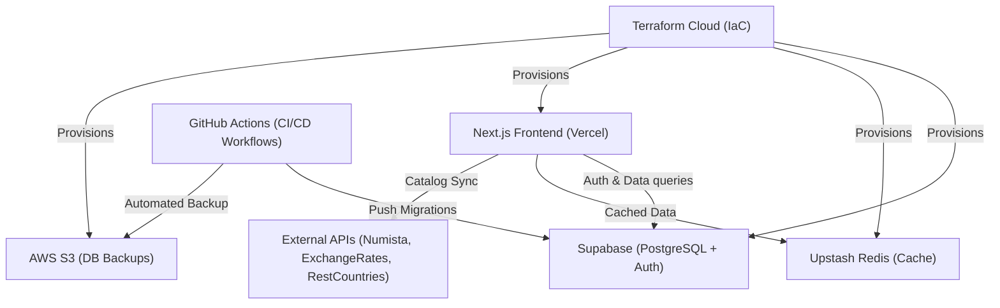

<div align="center">

  # Money Collection App

  *A full-stack, cloud-native application for cataloging and managing banknote collections.*

  [](https://www.terraform.io/)
  [](https://nextjs.org/)
  [](https://www.typescriptlang.org/)
  [](https://supabase.com/)
  [](https://upstash.com/)
  [](https://vercel.com/)
  [](https://aws.amazon.com/)

  [Overview](#overview) • [Features](#features) • [Architecture](#architecture) • [Project Structure](#project-structure) • [Environment Variables & Secrets](#environment-variables--secrets) • [Getting Started](#getting-started) • [Deployment](#deployment)

</div>

---

## Overview

**Money Collection App** is a cloud-native application for banknote collectors to record and manage banknote collections. 

The application pairs a modern Next.js frontend with Supabase PostgreSQL for database storage and user authentication, Upstash Redis for API caching, and Numista API integrations for global currency cataloging.

All underlying cloud infrastructure, including database provisioning, caching layers, Vercel deployments, and AWS S3 database backups, is managed declaratively with Terraform and automated through GitHub Actions CI/CD workflows.

## Features

- 💵 **Banknote Inventory Management** — Keep track of notes in your collection with detailed information including grade (`G`, `VG`, `F`, `VF`, `XF`, `AU`, `UNC`), denomination, physical dimensions, material, images, and Numista references.
- 🌐 **Global Catalog & Search** — Search banknotes across currencies and issuing countries using the Numista catalog.
- 📊 **Analytics & Valuation Dashboard** — Interactive charts visualizing collection breakdowns by currency, year of issue, grade distribution, and total collection value.
- 🔐 **Multi-Tenant Security** — Authentication powered by Supabase Auth with Row Level Security policies scoping records to their respective owners.
- ⚡ **API Caching Layer** — Serverless Upstash Redis cache in front of external API integrations (Exchange Rates, REST Countries, Numista).
- 🏗️ **Infrastructure as Code** — Fully automated environment management across Supabase, Upstash, Vercel, and AWS via Terraform.
- 💾 **Automated DB Backups** — Scheduled GitHub Actions workflow performing PostgreSQL database dumps uploaded to an AWS S3 bucket with 30-day lifecycle expiration.

## Third-Party API integrations

- [Numista API](https://en.numista.com/api/doc/index.php) — For searching and importing banknote catalog data.
- [Exchange Rates API](https://exchangeratesapi.io/) — For calculating live collection value across multiple currencies.
- [REST Countries API](https://restcountries.com/) — For retrieving country details and flags.

## Architecture



## Project Structure

```text
money-collection-app/
├── frontend/           # Next.js 14+ web app (App Router, Tailwind CSS, TypeScript, shadcn/ui)
├── supabase/           # PostgreSQL migrations, schema, and Supabase config
├── terraform/          # Infrastructure as Code (Supabase, Vercel, Upstash, AWS)
│   └── bootstrap/      # AWS IAM OIDC bootstrap resources for GitHub Actions
└── .github/
    └── workflows/      # GitHub Actions CI/CD for deployments and DB backups
```

## Environment Variables & Secrets

### Application Environment Variables (`frontend/.env.local`)

These variables are required by the Next.js frontend application. In production, Terraform automatically provisions and injects these values directly into Vercel.

| Variable | Sensitive | Usage |
| :--- | :---: | :--- |
| `NEXT_PUBLIC_SUPABASE_URL` | No | Public Supabase project URL (e.g., `https://<project-id>.supabase.co`) for client-side API requests. |
| `NEXT_PUBLIC_SUPABASE_ANON_KEY` | No | Public Supabase Anonymous API key for authentication and client-side database queries under Row Level Security. |
| `NUMISTA_API_KEY` | **Yes** | API key for the [Numista API](https://en.numista.com/api/doc/index.php). Used by backend API routes (`/api/numista`) to search and import banknote catalog metadata. |
| `EXCHANGERATES_API_KEY` | **Yes** | API key for exchange rate data. Used by backend API routes (`/api/exchange-rates`) to calculate live collection value across multiple currencies. |
| `REST_COUNTRIES_API_KEY` | **Yes** | API key for REST Countries API. Used by backend API routes (`/api/countries`) to retrieve country details and flags. |
| `UPSTASH_REDIS_REST_URL` | No | REST endpoint URL for Upstash Redis used for API response caching. |
| `UPSTASH_REDIS_REST_TOKEN` | **Yes** | REST authentication token for Upstash Redis database access. |

### CI/CD GitHub Secrets & Variables

For automated deployments and database backups via GitHub Actions, set the following secrets and variables under **Repository Settings > Secrets and variables > Actions**.

#### GitHub Secrets

| Secret Name | Usage |
| :--- | :--- |
| `TF_API_TOKEN` | API Token for Terraform Cloud (`app.terraform.io`) used for remote state locking and workspace management. |
| `SUPABASE_ACCESS_TOKEN` | Personal access token for Supabase CLI to push schema migrations (`supabase db push`) and dump database backups (`supabase db dump`). |
| `SUPABASE_DB_PASSWORD` | Database password for the Supabase PostgreSQL instance. |
| `VERCEL_API_TOKEN` | Vercel API token used by Terraform to provision and deploy the Next.js application. |
| `UPSTASH_API_KEY` | Upstash API key used by Terraform to provision the serverless Redis database. |
| `NUMISTA_API_KEY` | Sensitive Numista API key injected by Terraform into Vercel environment variables. |
| `EXCHANGERATES_API_KEY` | Sensitive Exchange Rates API key injected by Terraform into Vercel environment variables. |
| `REST_COUNTRIES_API_KEY` | Sensitive REST Countries API key injected by Terraform into Vercel environment variables. |

#### GitHub Variables

| Variable Name | Usage |
| :--- | :--- |
| `AWS_REGION` | AWS Region for S3 database backup storage and IAM policies (e.g., `us-east-1`). |
| `AWS_RESOURCE_PREFIX` | Naming prefix used for AWS resources and bucket naming conventions. |
| `AWS_GITHUB_ACTIONS_ROLE_ARN` | AWS IAM Role ARN assumed passwordlessly by GitHub Actions via OIDC (generated via `./bootstrap.sh`). |
| `SUPABASE_ORGANIZATION_ID` | Supabase Organization ID under which projects are created. |
| `SUPABASE_PROJECT_NAME` | Project name for the Supabase database instance. |
| `SUPABASE_REGION` | Geographic region for the Supabase database instance (e.g., `us-east-1`). |
| `UPSTASH_EMAIL` | Email address registered with the Upstash account. |
| `REDIS_DATABASE_NAME` | Name of the Upstash Redis database instance. |
| `REDIS_REGION` | Primary region for the Upstash Redis instance (e.g., `us-east-1`). |
| `VERCEL_PROJECT_NAME` | Target project name on Vercel (`money-collection-app`). |

## Getting Started

### Prerequisites

- [Node.js](https://nodejs.org/) v18+ and `npm`
- [Supabase CLI](https://supabase.com/docs/guides/cli) (`npm i -g supabase`)
- [Terraform](https://www.terraform.io/) v1.9+


### Local Development

1. **Clone the repository:**
   ```bash
   git clone https://github.com/hienmarc/money-collection-app.git
   cd money-collection-app
   ```

2. **Start local Supabase services:**
   ```bash
   cd supabase
   supabase start
   ```

3. Setup environment variables for local development. Create a `.env.local` file in the `frontend/` directory with the required variables (see [Environment Variables & Secrets](#environment-variables--secrets) section above).

4. **Run the frontend app:**
   ```bash
   cd ../frontend
   npm install
   npm run dev
   ```

5. Open [http://localhost:3000](http://localhost:3000) in your browser.


## Cloud deployment

### Prerequisites
- [Terraform Cloud](https://app.terraform.io/) account.
- [Vercel](https://vercel.com/) account.
- [Supabase](https://supabase.com/) account and organization.
- [AWS](https://aws.amazon.com/) account with sufficient permissions to create S3 buckets and IAM roles.
- [AWS CLI](https://aws.amazon.com/cli/) v2+ locally installed (for bootstrap script)
- [Upstash](https://upstash.com/) account.

### Setup Terraform Cloud

You must first configure Terraform Cloud with the following steps:

1. Create a Terraform Cloud account and organization (e.g., `money-collection-app-org`).
2. Create three workspaces: 
- `dev` and `prod` and give them the tag `money-collection-app`.
- `money-collection-app-bootstrap` for the bootstrap module.

### Bootstrap AWS OIDC for GitHub Actions

Create a `bootstrap.tfvars` file in the `terraform/bootstrap/` directory with the following content:

```hcl
aws_region = "<your-aws-region>"
aws_resource_prefix = "<your-resource-prefix>" # Prefix for AWS resources (e.g., `mca` for Money Collection App)
github_repo = "<your-github-username>/<your-repo-name>"
```

In a terminal where you are logged into AWS CLI with sufficient permissions, run the bootstrap script to create an OIDC identity provider and IAM role for GitHub Actions:

```bash
./bootstrap.sh
```

### GitHub Actions CI/CD

Deployment is fully automated using GitHub Actions workflows:

- **Deployment Pipeline** (`.github/workflows/deploy.yml`): Triggers on pushes to `main` or `dev`. Applies Terraform plans to provision infrastructure and runs `supabase db push` to synchronize database migrations.
- **Database Backup Pipeline** (`.github/workflows/backup-db.yml`): Scheduled or manually triggered workflow that dumps Supabase PostgreSQL data from the production environment and uploads it to AWS S3.

Important : Environment variables must be configured in GitHub Actions secrets and variables for successful deployment and backup operations (see [Environment Variables & Secrets](#environment-variables--secrets) section above).

